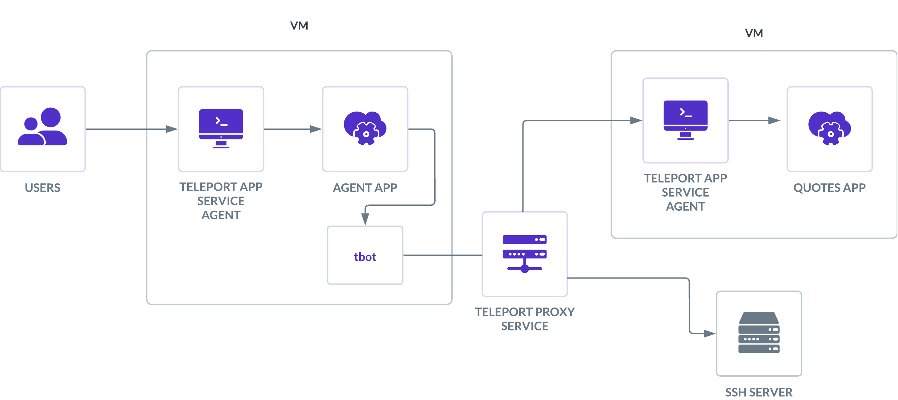

# agentic-identity-demo



A simple PNPM workspaces mono repo with web, backend and agent packages demonstrating Teleport's agentic identity and machine-to-machine authentication.

Web - A frontend app for users to interact with the agent.
Backend - Hosts and provides an API for the web app, and interacts with the agent.
Agent - LangChain-based agent that can execute SSH commands and fetch quotes via Teleport.

## Configuration

Before deploying, you need to configure the application for your Teleport cluster:

1. **Copy the example configuration:**
   ```bash
   cp config.example.yaml config.yaml
   ```

2. **Edit `config.yaml` with your values:**
   - `teleport.cluster_domain`: Your Teleport cluster domain (e.g., `myteleport.example.com`)
   - `teleport.app_server`: The hostname where the agent app will be deployed
   - `teleport.ssh_target`: The server the agent will SSH into
   - `teleport.tokens`: Your Teleport join tokens for authentication
   - `teleport.k8s_cluster_name`: Your Kubernetes cluster name (get from `tctl get kube_cluster`)
   - `aws`: Your AWS ECR registry details (for Quotes application)

3. **Update the Ansible inventory:**
   Edit `ansible/hosts` to match your app server hostname from `config.yaml`

4. **Set the GOOGLE_API_KEY environment variable:**
   ```bash
   export GOOGLE_API_KEY="your-actual-google-gemini-api-key"
   ```
   This is required for the LLM agent to function. The key will be read during Ansible deployment.

## Web

A React app (Typescript) using vite, styled-components and Tanstack query.

### Development

Run `pnpm dev` to start the development server. Requests are proxied to the
backend running on port 5200.

### Build

Run `pnpm build` to build the distributed version of the app. This is served by
the backend.

## Backend

A Node.js backend using Koa (Typescript). The frontend web app is service from the '.web'
directory. The Teleport Assertion token (injected by Teleport App access) is
parsed and relayed to the client as a cookie.

### Development

Run `pnpm dev` to start the development server. This will also copy the web
distribution - be sure to build the web app first.

### Build

Run `pnpm build` to build the backend for distribution.

## Deployment

### Prerequisites

- Teleport cluster with Machine ID configured
- EC2 instance or VM registered in Teleport with appropriate labels
- GitHub repository secrets configured (for GitHub Actions deployment)
- Google Gemini API key

### Using Ansible

1. Ensure `config.yaml` is configured with your values
2. Set the GOOGLE_API_KEY environment variable
3. Run the Ansible playbook:
   ```bash
   export GOOGLE_API_KEY="your-api-key"
   ansible-playbook -i ansible/hosts ansible/agent.yml
   ```

### Using GitHub Actions

The workflows will automatically read from `config.yaml`:
- `.github/workflows/build_and_deploy_agent.yaml` - Deploys the agent application
- `.github/workflows/build_and_deploy_quotes.yaml` - Deploys the quotes service

## Environment Variables

The agent supports the following environment variables:

- `GOOGLE_API_KEY`: Google Gemini API key (required)
- `SSH_TARGET_HOST`: Target hostname for SSH commands (default: from config)
- `SSH_CONFIG_PATH`: Path to SSH config file (default: `/home/awesomeagent/machine-id/ssh_config`)
- `QUOTES_API_URL`: URL for the quotes API (default: `http://localhost:3000/api/quotes/random`)
